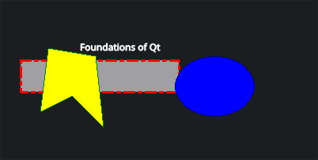
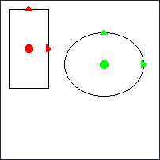

The directory contains

- `hello`: Graphics View Framework hello sample based on *Foundations of Qt Development* book from Chapter 7, Listing 7-19

- `transform`: Graphics View Framework transform sample based on *Foundations of Qt Development* book from Chapter 7, Listings 7-20, 7-21

- `input`: Graphics View Framework input (and custom graphics-item) sample based on *Foundations of Qt Development* book from Chapter 7, Listings 7-22, ..., 7-31

- `image`: Graphics View Framework show image sample with `QGraphicsPixmapItem` class.
